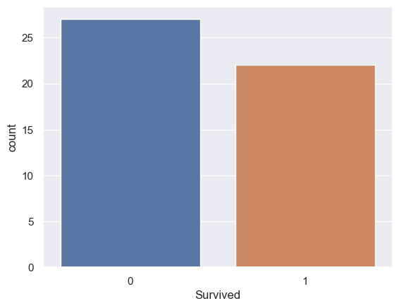
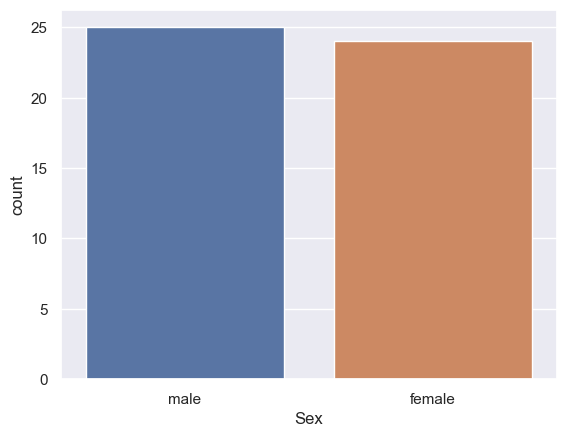
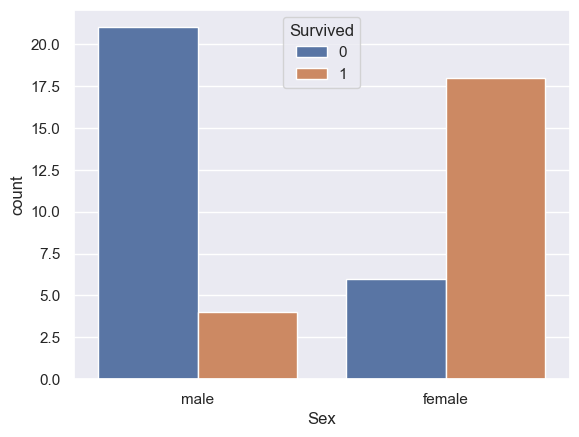
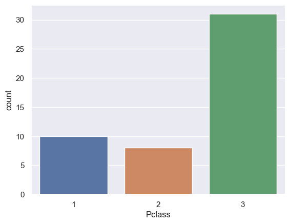
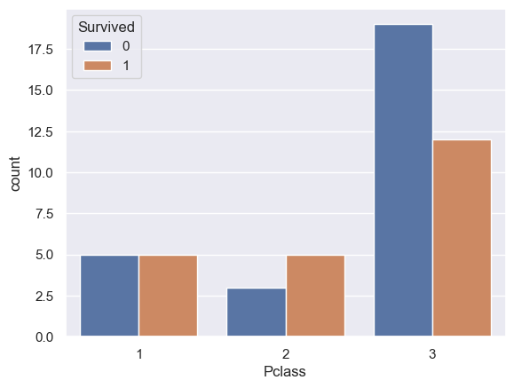

# Titanic-Classification
Task:-
Make a system which tells whether the person will be save from sinking. What factors were most likely lead to success-socio-economic status, age, gender and more.

So the data has information about passengers on the Titanic, such as `name` , `sex`, `age`, `survival`, `economic status(class)`, etc.


```bash
import numpy as np
import pandas as pd
import matplotlib.pyplot as plt
import seaborn as sns
from sklearn.model_selection import train_test_split
from sklearn.linear_model import LogisticRegression
from sklearn.metrics import accuracy_score

```

| PassengerId  | Survived | Pclass | Name | Sex | Age | SibSp | Parch | Ticket | Fare | Cabin | Embarked |                                                            
| :--- | :--- |:--- | :--- | :--- | :--- | :--- | :--- | :--- | :--- | :--- |:--- |
| 1  | 0 | 3 | Braund, Mr. Owen Harris	| male | 22.0 | 1 | 0 | A/5 21171 | 7.2500 | NaN | S
| 2  | 1 | 1 | Cumings, Mrs. John Bradley (Florence Briggs Th... | female | 38.0 | 1 | 0 | PC 17599 | 71.2833 | C85 | C |
| 3  | 1 | 3 | Heikkinen, Miss. Laina | female | 26.0 | 0 | 0 | STON/023101282 | 7.9250 | NaN | S |
| 4  | 1 | 1 | Futrelle, Mrs. Jacques Heath (Lily May Peel) | female | 35.0 | 1 | 0 | 113803 | 53.1000 | C123 | S |
| 5  | 0 | 3 | Allen, Mr. William Henry	 | male | 35.0 | 0 | 0 | 373450 | 8.0500 | NaN | S |


## Data Visualisation
>Making the count plot for Survived





>Examining the survival statistics, a large majority of males did not survive the ship sinking. However, a majority of females did survive the ship sinking







## Model Training
```bash
model = LogisticRegression()
#training the Logistic Regression model with training data
model.fit(X_train, Y_train)
```
## Model Evaluation
>Accuracy Score of Training data
```bash
training_data_accuracy = accuracy_score(Y_train, X_train_prediction)
print('Accuracy score of training data : ', training_data_accuracy)
```
**Prediction have an accuracy for training data :** 87.17%  <!--~~(0.8717948717948718)~~-->


>Accuracy Score of Testing data
```bash
test_data_accuracy = accuracy_score(Y_test, X_test_prediction)
print('Accuracy score of test data : ', test_data_accuracy)
```
**Prediction have an accuracy :** 70.00 %   <!--(0.7)-->

## License

[MIT](https://choosealicense.com/licenses/mit/)
